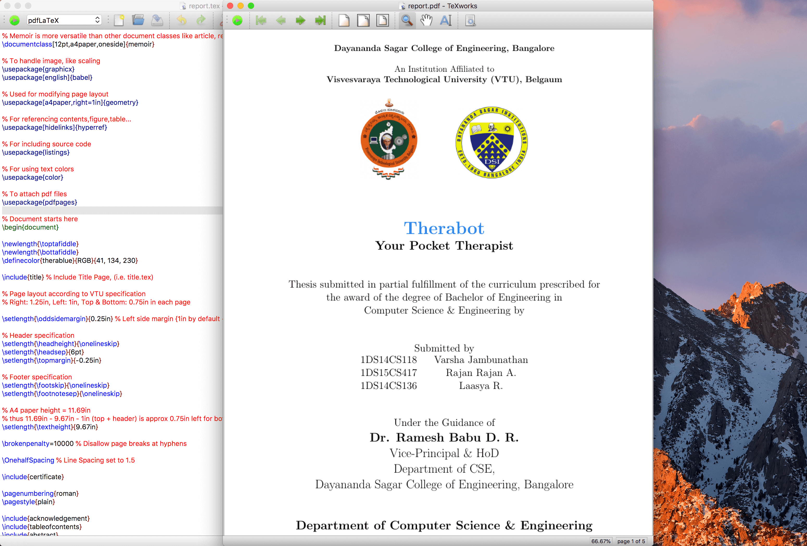

# VTU DSCE Project Report Template

Written in  by <a href="http://www.amruthpillai.com/">Amruth Pillai</a>.

## Installation

* **TeXworks**
  * Download the binary file from: https://github.com/TeXworks/texworks/releases (.exe for Windows, .dmg for macOS)
* **TeX Live**
  * Donwload here: https://www.tug.org/texlive/
  * for Windows & Linux
* **MacTeX**
  * Download here: http://www.tug.org/mactex/
  * for macOS

## Execution

* Open up `report.tex` using TeXworks
* Select pdfLaTeX from the compiler dropdown
* Press the big green play button

## Screenshots

## Resources for Learning 

* https://www.sharelatex.com/learn/Learn_LaTeX_in_30_minutes
* http://www.science.uva.nl/onderwijs/lesmateriaal/latex/latexcourse.pdf
* http://www.research.vtu.ac.in/research/resources/latex-vtu-ws.pdf